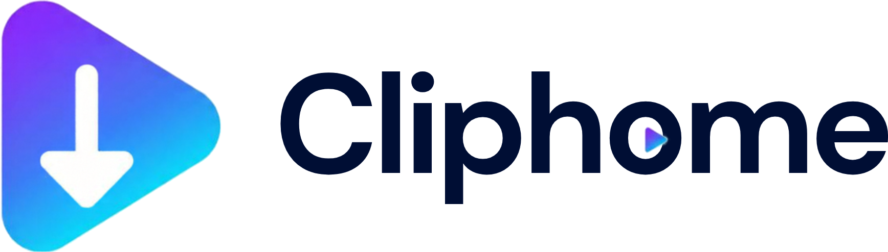

<p align="center">
  
</p>

<p align="center">
  <strong>Paste a link. Pick a folder. The clip comes home.</strong>
</p>

<p align="center">
  A local video downloader for <b>YouTube</b>, <b>Facebook</b>, and <b>X</b>.<br />
  Runs on your machine — nothing is uploaded to a website.
</p>

<p align="center">
  <a href="#quick-start"></a>
  
  
</p>

---

## Why Cliphome

| | |
| :--- | :--- |
| **Yours** | Files save to a folder you choose on this computer |
| **Simple** | Paste one link or many — no account, no cloud queue |
| **Flexible** | Best / 1080p / 720p / … and video or audio (MP3) |
| **Honest** | Personal use only — keep what you are allowed to keep |

---

## What you can paste

- **YouTube** — videos, Shorts, and playlists
- **Facebook** — videos, Reels, and `fb.watch` links
- **X (Twitter)** — video posts (`x.com/…/status/…` or `twitter.com/…/status/…`)
- **Batches** — several links at once (new lines or commas)

### Playlists

| Link style | What happens |
| :--- | :--- |
| `youtube.com/playlist?list=…` | Whole playlist → folder named after the playlist |
| `watch?v=…&list=…` | Video inside a playlist → **this video only** by default, or opt in to the whole list |

Facebook and X are one video per link. Login-only posts can fail — Cliphome does not read your browser cookies.

---

## Controls

| Control | Default | Notes |
| :--- | :--- | :--- |
| **Save to** | — | Browse to any folder on this Mac |
| **Quality** | `1080p` | Last choice is remembered |
| **Media** | Video | Audio saves as MP3 |

If some links fail (403, login walls, etc.), they appear in a list — copy them or hit **Retry failed**.

---

## Quick start

**You need**

- Python 3  
- Node (for `npm start`; yt-dlp also uses it for YouTube)  
- ffmpeg — `brew install ffmpeg`

**Then**

```bash
npm run setup
npm start
```

Open **[http://127.0.0.1:8765](http://127.0.0.1:8765)**.

| Command | Use when |
| :--- | :--- |
| `npm start` | Everyday run |
| `npm run dev` | Changing Python — auto-reloads |
| `Ctrl+C` | Stop the app |

---

## Tips

- Keep Cliphome on **your** machine. It is not a public web service.
- If downloads start failing after a site change, refresh yt-dlp:

```bash
.venv/bin/pip install -U "yt-dlp[default]"
```

---

<p align="center">
  <sub>Built to stay local. Your clips, your folder, your home.</sub>
</p>
